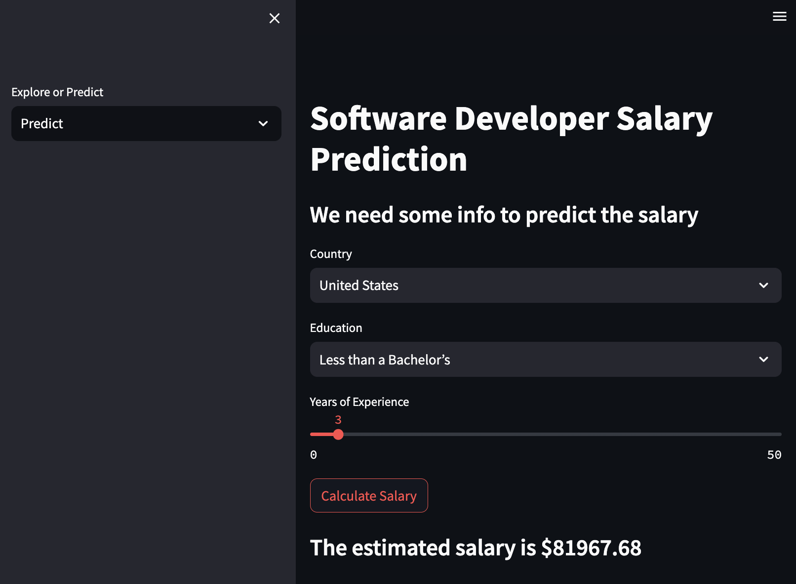
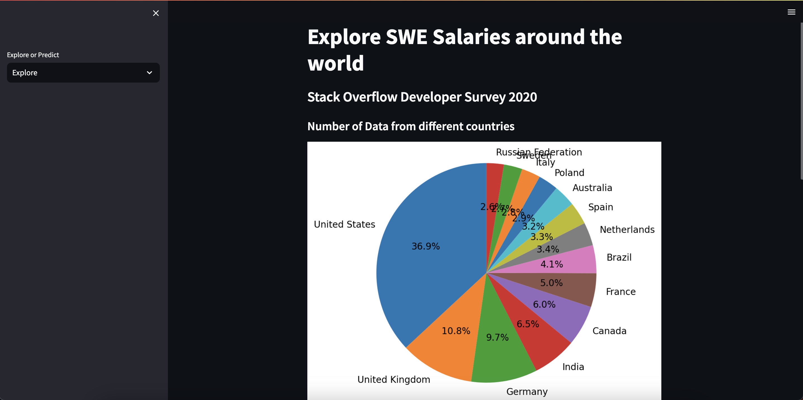
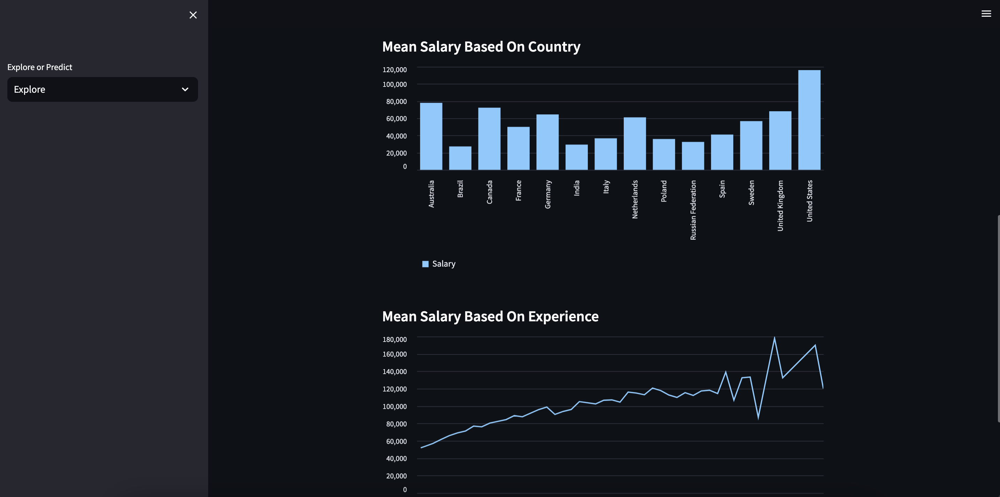

# Salary Prediction ML App
This is a web application to predict salary of Developers around the world based on the 2022 Stack Overflow Annual Developer Survey.

# Made By: Eric Sun

# Logs: 
1. Download data from (https://insights.stackoverflow.com/survey)
2. Clean Data
3. Test different training models (RandomForestRegression had best results)
4. Build web application using streamlit
5. Deploy

# Key Notes:
1. Cannot deploy to streamlit due to large size of dataset
2. As of June 2023, Stack Overflow does not provide an official API specifically for downloading the entire Developer Survey dataset.
3. Thus, to access website, git clone git@github.com:eric-sun92/salary_predictions.git
4. pip install -r requirements.txt
5. Then download 2020 dataset at https://insights.stackoverflow.com/survey and drag file into salaryapp folder.
6. Run streamlit run app.py in command line

# Demo Pictures:

